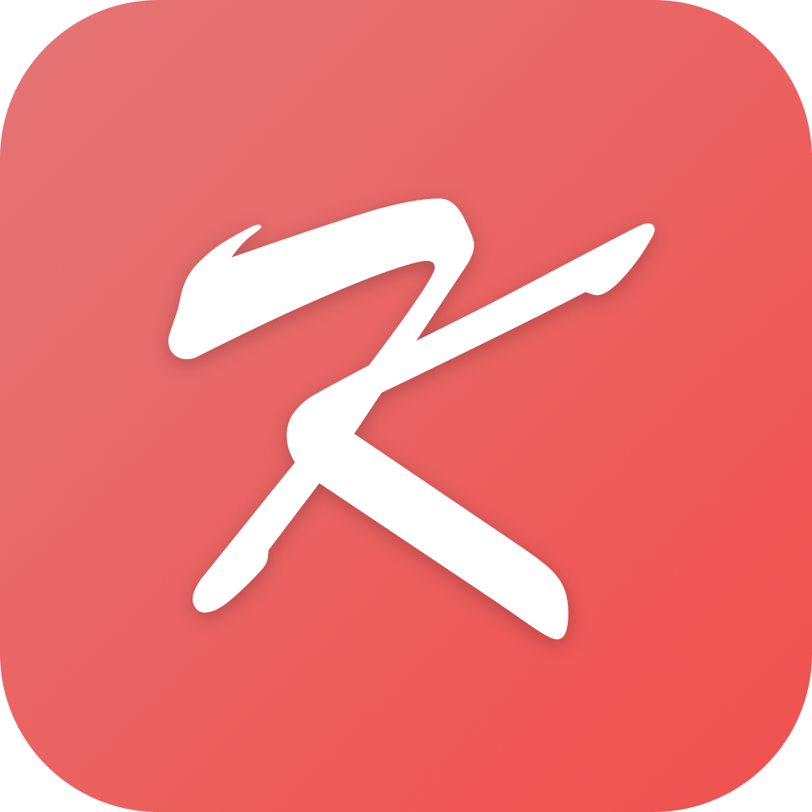

> 주머니 속 강원고등학교, 강고 포켓

강고 포켓 iOS는 강원고등학교 학생들을 위한 iPhone 및 iPad용 애플리케이션입니다. 

 

# 강고 포켓 iOS

> 강원고등학교 학생들을 위해 5년간 힘써왔던 강고 포켓 시리즈의 모든 서비스가 2020년 12월 02일부로 종료되었습니다.
>  강고 포켓은 안드로이드 버전을 시작으로 iOS 버전, Web 버전을 차례로 출시하며 복잡한 학교 시스템 속 보탬이 되기 위해 노력했습니다.
>  개발자의 졸업과 입대, 두 번의 고비를 넘겨 많은 분들의 도움과 지지를 받았음에도 서버와 애플리케이션의 유지가 힘들다는 판단에 따른 결정입니다.
>  강고 포켓의 여정은 끝이 났지만, 이후 제 2의 강고 포켓이 탄생하길 기대하며 여태까지 만들었던 소스를 모두 공개하려고 합니다.
>  - [강고 포켓 안드로이드](https://github.com/soc06212/kanggo-pocket-android)
>  - **[강고 포켓 iOS](https://github.com/soc06212/kanggo-pocket-ios) **
>  - [강고 포켓 Web](https://github.com/soc06212/kanggo-pocket-web)
>  강고 포켓 안드로이드/ iOS는 개인정보를 기기 내에서 저장하고 처리하기 때문에 앱을 삭제하면 저장된 정보가 삭제됩니다.
>  강고 포켓 Web은 2020년 12월 01일 18시 30분, 서버가 종료됨과 함께 영구적으로 삭제되었습니다.
>  개인정보처리방침에 대한 자세한 정보는 [강고 포켓 개인정보 처리방침](https://ridsoft.xyz/privacy/basic_policy.html)을 참고해 주시기 바라며, 기타 문의는 [홈페이지](https://ridsoft.xyz)를 통해 하실 수 있습니다.

 

## 기능

1. 시간표
    > 시간표 기능은 강고 포켓의 가장 중요하면서도 주요한 기능입니다.
    >  단순히 시간표 메뉴의 '시간표 업데이트' 버튼을 누르면, 강고 포켓은 서버에서 자동으로 시간표를 다운로드할 것입니다.

2. 급식 정보
    > 급식 정보는 학교에서 나이스에 제공하는 데이터를 기반으로 합니다.
    >  강고 포켓의 급식 메뉴에 들어가면 상단에 '급식 업데이트' 버튼과 ' '알러지 정보' 버튼을 찾을 수 있습니다. 
    >  
    >  강고 포켓이 다른 앱과 다른 점은 여기에 있습니다.
    >  바로 한번 급식 정보를 업데이트 하게 되면 그 날의 급식 정보만 저장하는 것이 아니라, 그 주의 급식 데이터를 모두 저장한다는 것입니다.
    >  
    >  또한 강고 포켓을 이용하는 주 사용자는 학생들이기 때문에, 자주 확인하는 급식 메뉴를 저장하여 데이터 소모를 아낄 수 있도록 했습니다.

3. 기타 기능
    > 이 외에도 교실 배치도, 생활 일과표, 학교 정보 등 유용한 정보를 제공하는 기능도 탑재되어 있습니다.
    >  학생증을 저장하여 도서관과 식당에서 사용할 수 있는 모바일 학생증 기능이 포함되어 있습니다. 

 

## 개발 사양
* 개발 언어: Swift 4.0
* 최소 iOS 버전: 9.0

 

## 오픈소스 라이선스
* [Kanna](https://github.com/tid-kijyun/Kanna)
* [Alamofire](https://github.com/Alamofire/Alamofire)
* [RSBarcodes_Swift](https://github.com/yeahdongcn/RSBarcodes_Swift)
